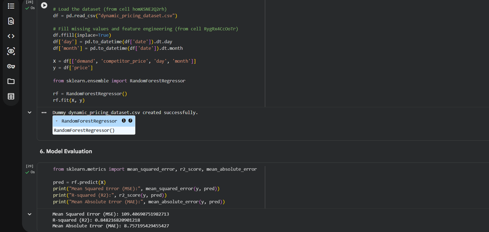

# 💰 Dynamic Pricing Prediction System

An end-to-end AI-powered dynamic pricing and predictive analytics project built using Python, Pandas, Scikit-learn, and Streamlit.

## 📌 Project Overview

This project demonstrates a complete dynamic pricing workflow including:

* Data collection and preprocessing
* Exploratory Data Analysis (EDA)
* Demand and pricing trend analysis
* Predictive analytics
* Price optimization modeling
* Deployment using Streamlit

The application helps businesses analyze pricing trends, demand patterns, and optimize product pricing through an interactive web interface.

---

## 🚀 Live Demo

🔗 Streamlit App: https://dynamic-pricing-engine-wjb2ndbn45az34gzzzn3na.streamlit.app/

---

## 📂 Project Structure

```bash
├── dynamic_pricing_system.ipynb
├── app.py
├── model.pkl
├── requirements.txt
├── dataset.csv
├── output.png
└── README.md
```

---

## 🛠️ Technologies Used

* Python
* Pandas
* NumPy
* Scikit-learn
* Streamlit
* Joblib
* Matplotlib
* Seaborn

---

## ⚙️ Features

✅ Dynamic price prediction
✅ Demand trend analysis
✅ Interactive Streamlit dashboard
✅ Real-time pricing insights
✅ Predictive analytics support
✅ Business intelligence visualization

---

## 📊 Machine Learning Workflow

1. Data Collection
2. Data Cleaning
3. Data Analysis
4. Feature Engineering
5. Model Training
6. Model Saving using Joblib
7. Web App Development
8. Deployment using Streamlit Cloud

---

## ▶️ Run Locally

Clone the repository:

```bash
git clone https://github.com/tarunibabu2006-tech/dynamic-pricing-system
```

Install dependencies:

```bash
pip install -r requirements.txt
```

Run the application:

```bash
streamlit run app.py
```

---

## 📸 Output Screenshot



---

## 🌐 Deployment

This project is deployed using:

* GitHub
* Streamlit Community Cloud

---

## 👨‍💻 Author

Tarunika Babu

GitHub: https://github.com/tarunibabu2006-tech

---

## ⭐ Future Improvements

* Real-time pricing optimization
* API integration
* Cloud deployment
* AI-powered forecasting
* Advanced analytics dashboard
